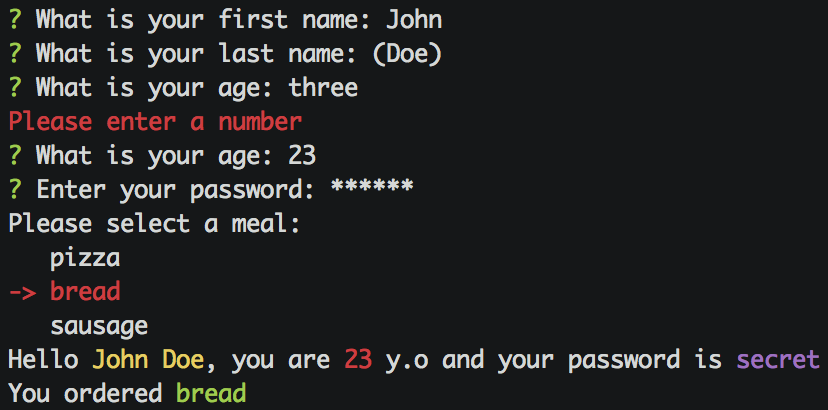

# JTerm

A friendly java/groovy library to collect user inputs in commandline applications

## Usage

### Groovy

The following groovy script:

```groovy
@Grab(group='com.github.geowarin', module='jterm', version='0.3')
import com.github.geowarin.jterm.JTerm
import com.github.geowarin.jterm.Validator

String firstName = JTerm.input('What is your first name')
String lastName = JTerm.input('What is your last name', 'Doe')

Validator ageValidator = { input -> input.matches(/\d+/) ? null : 'Please enter a number' }
String age = JTerm.input('What is your age', ageValidator)

String password = JTerm.password('Enter your password')

JTerm.println('Please select a meal:')
def result = JTerm.menu('pizza', 'bread', 'sausage')

JTerm.println("Hello @|yellow $firstName $lastName|@, you are @|red $age|@ y.o and your password is @|magenta $password|@")
JTerm.println("You ordered @|green $result|@")
```

Will produce this lovely output:



### Java

You can also use it in java:

```java
package test;

import com.github.geowarin.jterm.JTerm;
import com.github.geowarin.jterm.Validator;

public class Main {

    public static void main(String[] args) {

        String firstName = JTerm.input("What is your first name");
        String lastName = JTerm.input("What is your last name", "Doe");

        Validator ageValidator = (input) -> input.matches("\\d+") ? null : "Please enter a number";
        String age = JTerm.input("What is your age", ageValidator);

        String password = JTerm.password("Enter your password");

        JTerm.println("Please select a meal:");
        String result = JTerm.menu("pizza", "bread", "sausage");

        JTerm.println("Hello @|yellow " + firstName + " " + lastName + "|@, you are @|red " + age + "|@ y.o and your password is @|magenta " + password + "|@");
        JTerm.println("You ordered @|green " + result + "|@");
    }
}
```

## API

#### String JTerm.input(String prompt = '', String defaultValue = '')

Ask a question to the user and returns the answer, which can be the default
value if no input was typed

#### String JTerm.password(String prompt = '', String defaultValue = '')

Same as above but with a masked input


#### String JTerm.input(String prompt = '', Validator validator = null)

Asks the question until the input is valid.
The `Validator` is a simple interface:

```java
interface Validator {

  /**
   * @param input The input to validate
   * @return null if input is valid, an error message otherwise
   */
  String validate(String input)
}
```
#### String JTerm.password(String prompt = '', Validator validator = null)

Same as above but with masked input

#### T JTerm.menu(T... items)
#### T JTerm.menu(Map<T, String>... items)

Displays a menu with the items passed as parameters.
Users can then use the keyboard arrows to select one entry in the menu.

You use a list of anything and the items will be displayed to the user using **toString()**.
Or you can use a map using anything as a key, and Strings as displayable values.
The menu will then return the key associated with the selected value.

#### println(String str = '')
#### println(String str, Color fontColor)
#### println(Ansi ansi)

Prints a string. You can use jansi colors:

```java
JTerm.println("@|yellow Hello|@")
```
Is equivalent to:

```java
JTerm.println("Hello", Ansi.Color.YELLOW)
```
And also to:

```java
JTerm.println(Ansi.ansi().fg(YELLOW).render('Hello'))
```

#### print(String str = '')
#### print(String str, Color fontColor)
#### print(Ansi ansi)

Same as above but without carriage return

## Availability

This package is hosted on https://bintray.com/bintray/jcenter[jcenter]

It is therefore available directly from a groovy grape.

You can also include the `jcenter()` repository in your gradle script.

Or add a bunch of XML in your pom.xml.

## Compatibility

Linux, MacOS, Windows

## Inspiration

Inspired by the fantastic https://github.com/SBoudrias/Inquirer.js[Inquirer.js].

## Dependencies

The library depends on the following:

* https://github.com/jline/jline2[jline]
* https://github.com/fusesource/jansi[jansi]

## License

MIT
